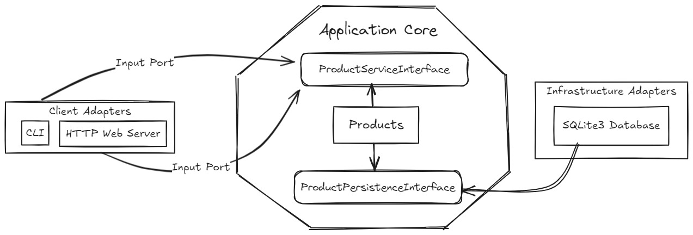

# Exemplo de desenvolvimento utilizando hexagonal architecture com Golang

Este repositório contém um exemplo de implementação da `Hexagonal Architecture` desenvolvido em `Golang`.

## Dinâmica da arquitetura



A arquitetura hexagonal visa separar a lógica de negócios do resto da aplicação (como a interface do usuário e a persistência de dados), permitindo que o núcleo da aplicação permaneça independente de detalhes técnicos. Isso facilita a substituição de adaptadores (como trocar SQLite por outro banco de dados ou adicionar uma nova interface gráfica) sem precisar modificar o núcleo da aplicação.

### 1. Application Core (Núcleo da Aplicação)

- ProductServiceInterface: Esta interface define as operações que o serviço de produto oferece. Ela representa a lógica de negócios central e é independente de qualquer tecnologia externa.

- Products: Este componente é o modelo de domínio que contém a lógica e os dados principais relacionados aos produtos. 

- ProductPersistenceInterface: Esta interface define as operações necessárias para persistir dados de produtos. Ela representa a comunicação entre o núcleo da aplicação e os adaptadores de infraestrutura.

### 2. Client Adapters (Adaptadores de Cliente)

- CLI (Interface de Linha de Comando): Este é um adaptador que permite que a aplicação seja acessada e manipulada via linha de comando. Ele serve como um ponto de entrada para a aplicação, permitindo que os usuários executem operações sobre os produtos usando comandos no terminal.
- HTTP Web Server: Este é um adaptador que permite que a aplicação seja acessada através de uma interface web. Ele expõe as funcionalidades da aplicação para serem consumidas via HTTP, geralmente por meio de uma API REST.

(Esses adaptadores de cliente utilizam as Portas de Entrada (Input Ports) para se comunicar com o núcleo da aplicação, invocando métodos do ProductServiceInterface.).

### 3. Infrastructure Adapters (Adaptadores de Infraestrutura)
- SQLite3 Database(db): Este é o adaptador de infraestrutura que gerencia a persistência de dados dos produtos. Ele implementa a interface ProductPersistenceInterface definida no núcleo da aplicação. Assim, o SQLite3 armazena e recupera dados de produtos conforme necessário.
(Este adaptador de infraestrutura usa as Portas de Saída (Output Ports) para se conectar ao núcleo da aplicação, permitindo a persistência dos dados de produtos.)

### Fluxo de Dados
- Portas de Entrada (Input Ports): Permitem que os adaptadores de cliente (CLI e HTTP Web Server) interajam com o núcleo da aplicação. Eles chamam os métodos do ProductServiceInterface para realizar operações como adicionar, editar ou remover produtos.
- Portas de Saída (Output Ports): São usadas para que o núcleo da aplicação se comunique com os adaptadores de infraestrutura. O ProductPersistenceInterface é usado para salvar ou recuperar dados no banco de dados SQLite3.

## Configuração do Ambiente

### 1. Clonando o Repositório

Clone este repositório para a sua máquina local:
```bash
git clone https://github.com/Lucassamuel97/hexagonal-architecture
cd hexagonal-architecture
```
### 2. Executando aplicação com docker-compose e entrando no container
```bash
    docker-compose up -d --build
    # Entrando no container
    docker exec -it appproduct bash
```

### 3. Comandos após entrar no container
```bash
    #Executa os testes da aplicação
    go test ./...

    # Comando para criar um produto via CLI
    go run main.go cli -a=create -n="Produto teste" -p=60.00
    # Buscar produto via CLI
    go run main.go cli -a=get -i="eef1d2d0-4530-4aef-a8b7-4c8842a13f8d"
    # desabilitar produto via CLI
    go run main.go cli -a=disable -i="eef1d2d0-4530-4aef-a8b7-4c8842a13f8d"
    # habilitar produto via CLI
    go run main.go cli -a=enable -i="eef1d2d0-4530-4aef-a8b7-4c8842a13f8d"

    #Sobe um WebServer na em localhost:9000
    go run main.go http
```
## Referencial teórico

Arquitetura Hexagonal: O que você precisa saber [Video](https://www.youtube.com/watch?v=or5zAOASPjU)


## Comandos úteis
// Para atualizar o mock após modificar o arquivo product.go
mockgen -destination=application/mocks/application.go -source=application/product.go application
